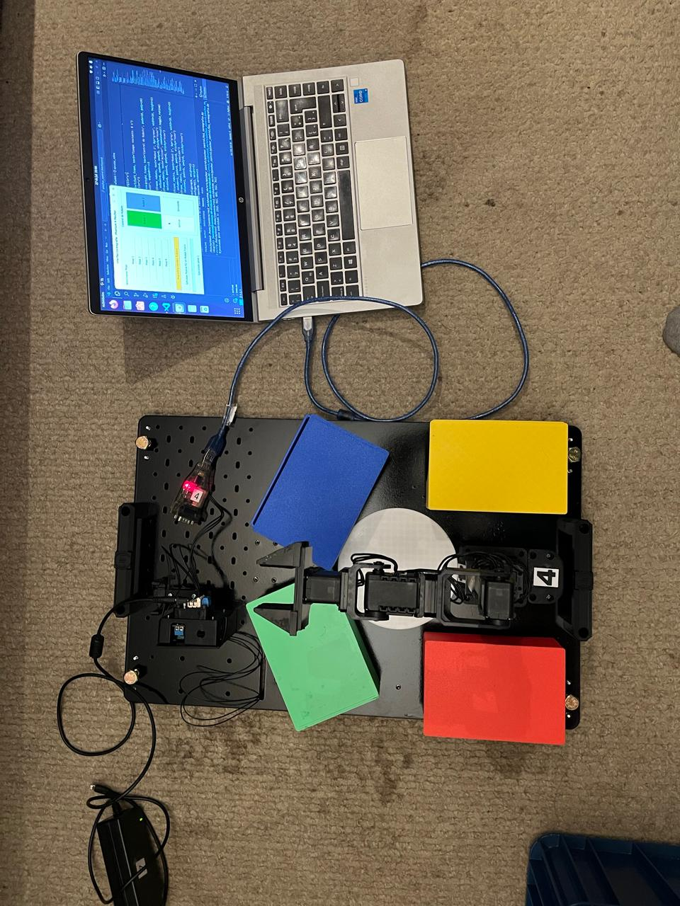
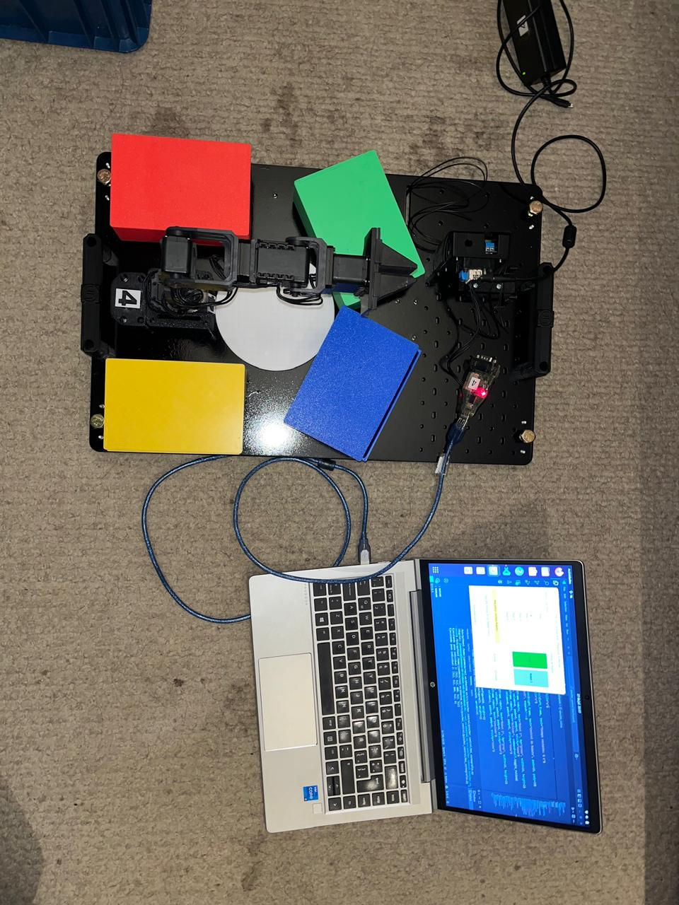
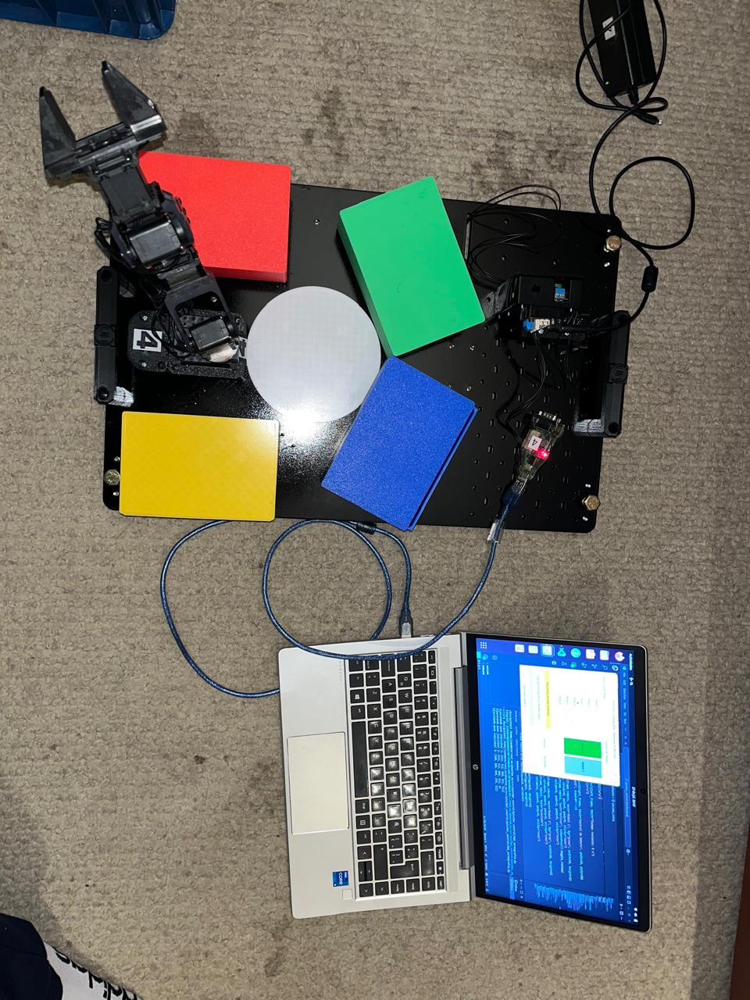
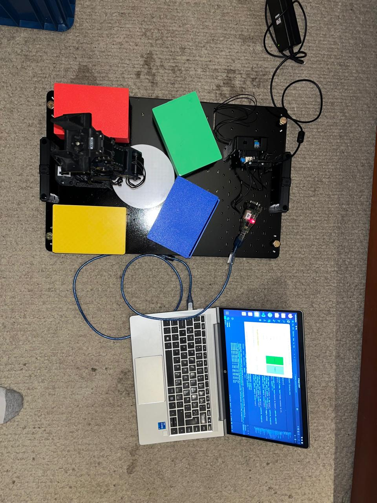
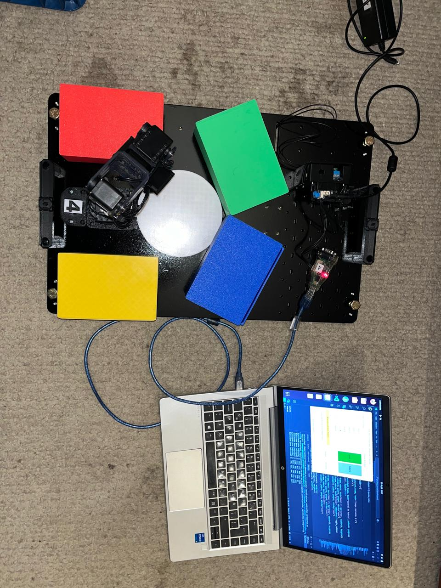
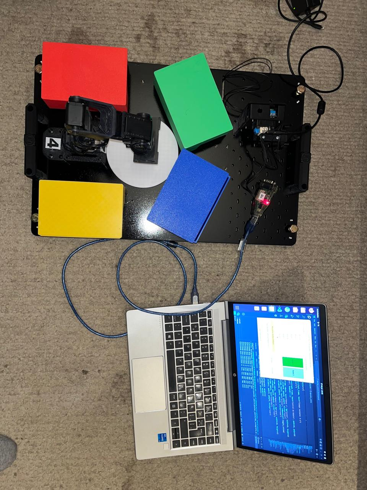
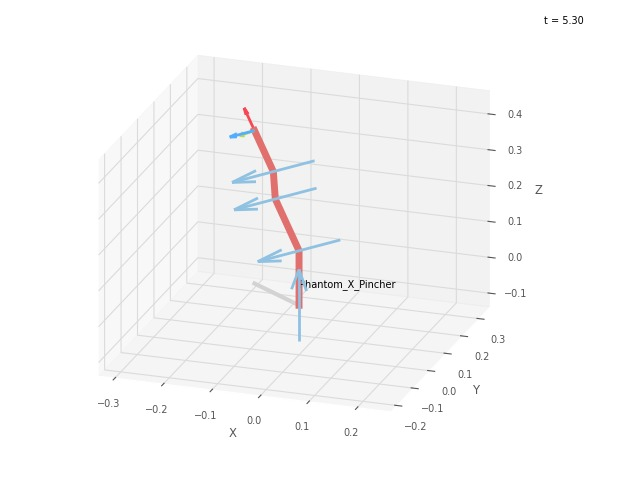
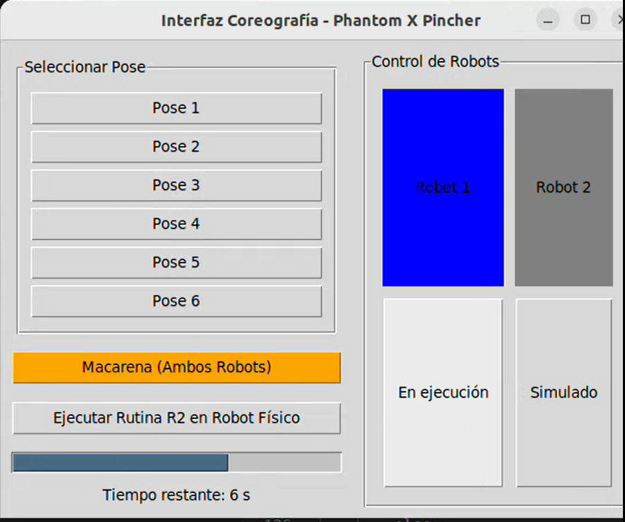

# Proyecto_Investigaci-o

**Coreografía programada de robots Phantom X Pincher**  
Facultad de Ingeniería – Universidad Nacional de Colombia  
Grupo: Juan David Meza, Andres Avilan   
Curso: Robótica de Investigación – [2025-I]

---

## 🎯 Descripción del Proyecto

Este repositorio documenta el proceso de diseño, preparación y ejecución de una coreografía colaborativa entre dos robots Phantom X Pincher. Se detallan las fases del proyecto desde la conceptualización, diseño cinemático y programación en Python, hasta la implementación física y visualización mediante interfaz gráfica.

El objetivo es sincronizar dos brazos robóticos para ejecutar una secuencia coreográfica definida, respetando límites articulares y tiempos, controlados desde una HMI desarrollada en Python usando Tkinter.

---

## 📂 Estructura del Repositorio

```
Proyecto_Investigaci-o/
├── Fotos/ # Imágenes de las 6 poses del robot
│ ├── pose1.jpg
│ ├── pose2.jpg
│ ├── pose3.jpg
│ ├── pose4.jpg
│ ├── pose5.jpg
│ └── pose6.jpg
├── codigo/ # Código fuente en Python (control e interfaz)
│ ├── hmi_coreografia.py
│ └── id_dynamixel.py
├── videos/ # Video demostrativo e interfaz gráfica
│ ├── demostración.mp4
│ └── interfaz.webm
└── README.md # Documentación principal del proyecto
```


---

## 🧠 Diagrama de Flujo

Se incluye un diagrama visual que describe el flujo de acciones de los robots, incluyendo activación, selección de poses, sincronización de rutina y visualización.

<div align="center">
  
</div>


## 🤖 Poses de la Coreografía (Miniaturas)

A continuación se muestran las 6 poses del robot junto con sus valores articulares (RAW), vistas desde una vista superior. Además, para simular el salto en baile para cambiar la orientación, tendríamos que sumar 90 grados a cada una de las primeras coordenadas. Para el brazo izquierdo, se cambia la rotación de la primera articulación, para así simular que el codo está hacia el otro lado. En el código se puede apreciar.

| Pose | Imagen | Valores RAW | poses del baile |
|------|--------|-------------| --------------- |
| Pose 1 |  | `[512, 512, 800, 512, 512]` | palmas hacia abajo |
| Pose 2 |  | `[512, 512, 800, 512, 0]` | Palmas hacia arriba | 
| Pose 3 |  | `[300, 300, 800, 250, 512]` | Palmas al hombro contrario | 
| Pose 4 |  | `[512, 690, 240, 512, 512]` | Palmas a la cabeza | 
| Pose 5 |  | `[700, 512, 900, 800, 512]` | Palmas a la parte contraria de la cadera |
| Pose 6 |  | `[512, 512, 900, 700, 512]` | Palmas a la parte correspondiente de la cadera |

## 📐 Plano de planta y descripción de coreografía

Las imágenes incluidas en la carpeta `Fotos/` representan la vista cenital (superior) del robot Phantom X Pincher en cada una de las 6 poses utilizadas en la coreografía.

Cada imagen corresponde a una configuración específica de los motores, tal como se describe en la tabla de poses implementada en el script `hmi_coreografia.py`.

Estas posiciones fueron cuidadosamente seleccionadas para asegurar fluidez en la coreografía, evitando colisiones y respetando los límites articulares.

Las imágenes cumplen la función de vista en planta, mostrando la progresión espacial de la coreografía desde un ángulo superior.


---

## 🧾 Código Python

Todo el código está implementado en Python, con módulos comentados para:

- Comunicación serial con los robots (USB) con ayuda de el archivo [`id_dynamixel.py`](codigo/id_dynamixel.py) sin embargo, en este punto se evidenció que, justamente, el segundo robot proporcionado no ejecuta los programas. Se verificó que los puertos utilizados tuvieran habilitado el grupo dialout.
- La imagen que se muestra a continuación fue generada mediante la ejecución del script `pentando.py`, el cual permite enviar una posición angular específica a los servos Dynamixel del robot Phantom X Pincher. En este caso, la pose corresponde a los ángulos `[x°, x°, x°, x°]` para las articulaciones de la base, hombro, codo y muñeca respectivamente. Además de ejecutar físicamente esta pose en el robot real, el script utiliza el modelo cinemático definido en `phantom_dh.py` y la librería `roboticstoolbox` para graficar la configuración del manipulador en pantalla. Esta visualización facilita la validación de la pose deseada antes de realizar la ejecución completa de la coreografía.

<div align="center">
  
</div>

- La siguiente imagen muestra la interfaz gráfica desarrollada con la biblioteca `Tkinter` en Python, incluida en el archivo `hmi_coreografia.py`. Esta interfaz permite al usuario controlar de manera intuitiva la ejecución de poses individuales y rutinas completas en el robot Phantom X Pincher. La sección izquierda ("Seleccionar Pose") contiene botones que invocan el método `self.ejecutar_pose_individual(i)` definido en el código, el cual utiliza la función `enviar_pose()` para enviar posiciones individuales a los motores Dynamixel.

- Debajo, se encuentra el botón naranja “Macarena (Ambos Robots)”, el cual ejecuta la rutina sincronizada de ambos robots mediante el método `self.macarena_rutina()`, iterando sobre las listas `poses` y `poses_robot2`. También se incluye un botón adicional que permite ejecutar la rutina del segundo robot en el robot físico (`self.ejecutar_rutina_robot2()`). Esto por la limitación en la cantidad de robots funcionales, para no estar comentando constantemente las lineas de codigo, ni cambiando los puertos. 

- En la parte inferior, se presenta una barra de progreso (`ttk.Progressbar`) que se actualiza en tiempo real con `self.barra["value"] = progreso`, junto con una etiqueta que muestra el tiempo restante por medio de `self.label_tiempo.config(...)`.

- La sección derecha (“Control de Robots”) permite observar el estado actual de cada robot. Por ejemplo, cuando el Robot 1 está en ejecución, el color de fondo cambia a azul con `self.estado_r1.config(bg="blue")`, y vuelve a verde al terminar.

<div align="center">
  
</div>

## 💻 Código de la Interfaz `hmi_coreografia.py`

Codigo completo comentado:   

```python
import tkinter as tk
from tkinter import ttk
import time
import threading
from dynamixel_sdk import PortHandler, PacketHandler

# -------------------- Configuración del robot --------------------
ADDR_GOAL_POSITION = 30
ADDR_TORQUE_ENABLE = 24
ADDR_MOVING_SPEED = 32
ADDR_TORQUE_LIMIT = 34

def enviar_pose(port, packet, ids, pose):
    for i, dxl_id in enumerate(ids):
        packet.write2ByteTxRx(port, dxl_id, ADDR_GOAL_POSITION, pose[i])
        time.sleep(0.05)

# -------------------- Poses en valores RAW --------------------
poses = [
    [512, 512, 800, 512, 512],
    [512, 512, 800, 512,   0],
    [300, 300, 800, 250, 512],
    [512, 690, 240, 512, 512],
    [700, 512, 900, 800, 512],
    [512, 512, 900, 700, 512]
]

# -------------------- Poses del Robot 2 --------------------
poses_robot2 = [
    [512, 512, 800, 512, 512],
    [512, 512, 800, 512,   0],
    [724, 300, 800, 250, 512],
    [512, 690, 240, 512, 512],
    [300, 512, 900, 800, 512],
    [512, 512, 900, 700, 512]
]

# -------------------- Clase para la interfaz --------------------
class CoreografiaHMI:
    def __init__(self, root):
        self.root = root
        self.root.title("Interfaz Coreografía - Phantom X Pincher")

        self.rutina_activa = False

        self.setup_ui()

        # Robot 1 config
        self.port1 = PortHandler('/dev/ttyUSB0')
        self.packet1 = PacketHandler(1.0)
        self.ids1 = [1, 2, 3, 4, 5]
        self.port1.openPort()
        self.port1.setBaudRate(1000000)
        for dxl_id in self.ids1:
            self.packet1.write1ByteTxRx(self.port1, dxl_id, ADDR_TORQUE_ENABLE, 1)
            self.packet1.write2ByteTxRx(self.port1, dxl_id, ADDR_MOVING_SPEED, 100)
            self.packet1.write2ByteTxRx(self.port1, dxl_id, ADDR_TORQUE_LIMIT, 800)

        # Robot 2 config (simulado)
        # self.port2 = PortHandler('/dev/ttyUSB1')
        # self.packet2 = PacketHandler(1.0)
        # self.ids2 = [1, 2, 3, 4, 5]
        # self.port2.openPort()
        # self.port2.setBaudRate(1000000)
        # for dxl_id in self.ids2:
        #     self.packet2.write1ByteTxRx(self.port2, dxl_id, ADDR_TORQUE_ENABLE, 1)
        #     self.packet2.write2ByteTxRx(self.port2, dxl_id, ADDR_MOVING_SPEED, 100)
        #     self.packet2.write2ByteTxRx(self.port2, dxl_id, ADDR_TORQUE_LIMIT, 800)

    def setup_ui(self):
        self.root.grid_columnconfigure(0, weight=1)
        self.root.grid_columnconfigure(1, weight=1)

        left_frame = tk.Frame(self.root)
        left_frame.grid(row=0, column=0, padx=10, pady=10, sticky="n")

        right_frame = tk.Frame(self.root)
        right_frame.grid(row=0, column=1, padx=10, pady=10, sticky="nsew")
        right_frame.grid_rowconfigure(0, weight=1)
        right_frame.grid_columnconfigure(0, weight=1)

        frame_mov = tk.LabelFrame(left_frame, text="Seleccionar Pose", padx=10, pady=10)
        frame_mov.pack(padx=5, pady=5, fill="both", expand=True)

        for i in range(6):
            btn = tk.Button(frame_mov, text=f"Pose {i+1}", command=lambda i=i: self.ejecutar_pose_individual(i))
            btn.pack(pady=2, fill="x")

        self.boton_macarena = tk.Button(left_frame, text="Macarena (Ambos Robots)", bg="orange", command=self.macarena_rutina)
        self.boton_macarena.pack(pady=10, fill="x")

        # Botón adicional: ejecutar rutina del robot 2 en el robot físico
        self.boton_r2_en_r1 = tk.Button(left_frame, text="Ejecutar Rutina R2 en Robot Físico", command=self.ejecutar_rutina_robot2)
        self.boton_r2_en_r1.pack(pady=5, fill="x")

        self.barra = ttk.Progressbar(left_frame, orient="horizontal", length=300, mode="determinate")
        self.barra.pack(pady=10, fill="x")

        self.label_tiempo = tk.Label(left_frame, text="Tiempo restante: 0 s")
        self.label_tiempo.pack(fill="x")

        frame_robots = tk.LabelFrame(right_frame, text="Control de Robots", padx=10, pady=10)
        frame_robots.pack(fill="both", expand=True)

        self.estado_r1 = tk.Label(frame_robots, text="Robot 1", bg="green", width=10, height=2)
        self.estado_r1.grid(row=0, column=0, padx=5, pady=5, sticky="nsew")
        self.boton_r1 = tk.Button(frame_robots, text="Activar", command=self.toggle_rutina)
        self.boton_r1.grid(row=1, column=0, padx=5, pady=5, sticky="nsew")

        self.estado_r2 = tk.Label(frame_robots, text="Robot 2", bg="gray", width=10, height=2)
        self.estado_r2.grid(row=0, column=1, padx=5, pady=5, sticky="nsew")
        self.boton_r2 = tk.Button(frame_robots, text="Simulado")
        self.boton_r2.grid(row=1, column=1, padx=5, pady=5, sticky="nsew")

        frame_robots.grid_columnconfigure(0, weight=1)
        frame_robots.grid_columnconfigure(1, weight=1)
        frame_robots.grid_rowconfigure(0, weight=1)
        frame_robots.grid_rowconfigure(1, weight=1)

    def toggle_rutina(self):
        if not self.rutina_activa:
            self.rutina_activa = True
            self.estado_r1.config(bg="blue")
            self.boton_r1.config(text="En ejecución")
            threading.Thread(target=self.ejecutar_rutina).start()
        else:
            print("Rutina ya en ejecución")

    def ejecutar_rutina(self):
        duracion_total = 18
        pasos = len(poses)
        duracion_pose = duracion_total / pasos

        for i, pose in enumerate(poses):
            if not self.rutina_activa:
                break
            print(f"Ejecutando paso {i+1}: {pose}")
            enviar_pose(self.port1, self.packet1, self.ids1, pose)
            progreso = int(((i + 1) / pasos) * 100)
            self.barra["value"] = progreso
            tiempo_restante = int(duracion_total - ((i + 1) * duracion_pose))
            self.label_tiempo.config(text=f"Tiempo restante: {tiempo_restante} s")
            time.sleep(duracion_pose)

        self.barra["value"] = 100
        self.label_tiempo.config(text="Rutina completada")
        self.estado_r1.config(bg="green")
        self.boton_r1.config(text="Activar")
        self.rutina_activa = False

    def ejecutar_rutina_robot2(self):
        # Ejecutar rutina de R2 en el robot físico (conectado a USB0)
        duracion_total = 18
        pasos = len(poses_robot2)
        duracion_pose = duracion_total / pasos

        for i, pose in enumerate(poses_robot2):
            print(f"[Robot Físico con Rutina R2] Paso {i+1}: {pose}")
            enviar_pose(self.port1, self.packet1, self.ids1, pose)
            progreso = int(((i + 1) / pasos) * 100)
            self.barra["value"] = progreso
            tiempo_restante = int(duracion_total - ((i + 1) * duracion_pose))
            self.label_tiempo.config(text=f"Tiempo restante: {tiempo_restante} s")
            time.sleep(duracion_pose)

        self.barra["value"] = 100
        self.label_tiempo.config(text="Rutina Robot 2 completada")

    def ejecutar_pose_individual(self, index):
        if 0 <= index < len(poses):
            pose = poses[index]
            print(f"Ejecutando pose individual {index+1}: {pose}")
            enviar_pose(self.port1, self.packet1, self.ids1, pose)
            self.label_tiempo.config(text=f"Ejecutado pose {index+1}")

    def macarena_rutina(self):
        duracion_pose = 16 / len(poses)
        for i in range(len(poses)):
            pose1 = poses[i]
            pose2 = poses_robot2[i]
            print(f"Macarena - Paso {i+1}")
            enviar_pose(self.port1, self.packet1, self.ids1, pose1)
            # enviar_pose(self.port2, self.packet2, self.ids2, pose2)
            self.barra["value"] = int(((i + 1) / len(poses)) * 100)
            self.label_tiempo.config(text=f"Macarena: Paso {i+1} ejecutado")
            time.sleep(duracion_pose)
        self.barra["value"] = 100
        self.label_tiempo.config(text="Macarena completada")

if __name__ == '__main__':
    root = tk.Tk()
    app = CoreografiaHMI(root)
    root.mainloop()

```

---

## 🎥 Video Presentación

La coreografía fue diseñada para ajustarse al ritmo de la canción "Macarena", cuya secuencia específica de baile tiene una duración aproximada de 9 segundos. Sin embargo, al evaluar las capacidades reales del robot Phantom X Pincher, se determinó que ejecutar las seis poses de forma segura y fluida en ese intervalo requería velocidades articulares excesivamente altas, lo cual podría comprometer la precisión, la estabilidad y la vida útil de los servos Dynamixel.

Por esta razón, se optó por duplicar el tiempo de ejecución de la rutina a 18 segundos, permitiendo que el robot alcance correctamente cada una de las poses con movimientos suaves y mecánicamente seguros. Para mantener la sincronización con la música y respetar el ritmo coreográfico original, los videos generados fueron acelerados a velocidad 2× (x2) durante la edición final.

(aca va el video de la demostración) 


## ⚙️ Requisitos


